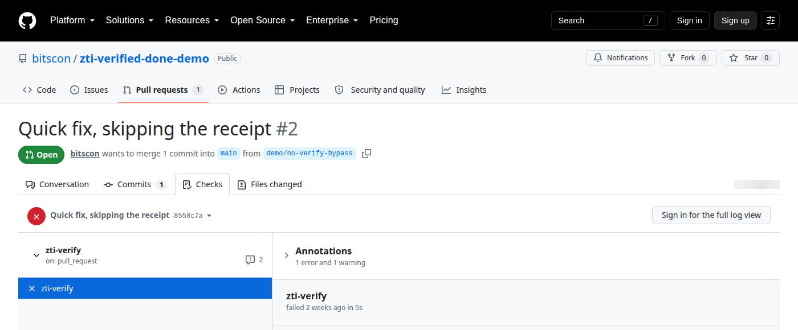

# zti-verified-done-demo

**This repository will not accept "done" on anyone's word — including an
AI's.** Every merge requires a hash-sealed receipt proving the required
checks were independently re-run against the exact bytes being merged.

It is the live demo for [ZTI Core](https://zerotrustintelligence.io) —
**self-hosted** agent governance (you run the control plane on your own
servers; nothing here is a hosted service). The plane governing this repo is
our public showroom copy at `demo.zerotrustintelligence.io`.

## Watch it work — the two PRs

- **The honest PR** — the developer ran `zti receipt`: the gate re-ran the
  tests itself, minted a receipt bound to the staged content's tree hash,
  and the `zti-verify` required check is **green**. Mergeable.
- **The bypass PR** — the commit was made with `git commit --no-verify`
  (git's documented local escape hatch, deliberately left open). No receipt
  exists for that content, so `zti-verify` is **red**:
  `DONE_WITHOUT_RECEIPT`. The merge button is dead. That is the point.

## See it for yourself — 2 minutes, nothing to install

1. Open [PR #2 — "Quick fix, skipping the receipt"](https://github.com/bitscon/zti-verified-done-demo/pull/2).
   It was committed with `git commit --no-verify`, skipping the local gate.
2. Look at its checks: **zti-verify is red.** Open the check's details — the
   runner asked the plane and got `DONE_WITHOUT_RECEIPT`, exit 2.
3. Look at the merge box: **blocked.** No receipt for that exact content, no
   merge — no matter who (or what) wrote it.
4. Now open [PR #1](https://github.com/bitscon/zti-verified-done-demo/pull/1):
   same required check, **green**, merged — that content was receipted first
   (`zti receipt` re-ran the tests independently before minting).
5. The plane answering those checks is live:
   `curl https://demo.zerotrustintelligence.io/v1/health`
6. PRs from forks fail the check too — outsiders can't mint receipts for this
   repo. That is the point.

### No login, no JavaScript, still visible

GitHub renders the merge box for signed-in users, so here is the block as a
static image, straight from the Checks tab of
[PR #2](https://github.com/bitscon/zti-verified-done-demo/pull/2), viewed
logged out (captured 2026-08-18):

The failing run itself is public too:
[the zti-verify check run for 8558c7a](https://github.com/bitscon/zti-verified-done-demo/actions/runs/30872603547/job/91877492065)
shows every step green until "Verify a passing receipt exists for exactly
this content," which exits 2: `DONE_WITHOUT_RECEIPT`.

Want this on your own repos? It's self-hosted — see
[zerotrustintelligence.io](https://zerotrustintelligence.io).

## How it works

One contract — pytest must pass; `.github/` and `.zti/` are out of bounds —
enforced three times over the same content address (the git tree hash):

| Tier | Where | Blocks |
|---|---|---|
| 1 — runtime | agent-side hook | out-of-scope / irreversible actions, live |
| 2 — commit | git pre-commit gate (`zti install-hooks`) | committing without a passing receipt |
| 3 — merge | the `zti-verify` required check in this repo | merging around Tiers 1–2 |

A receipt is minted only by re-running the contract's checks — an agent
*claiming* success is never the input. Receipts are hash-sealed
([ZTIP](https://github.com/bitscon/ztip), the open protocol) and the plane
re-verifies the seal before storing anything. Change one byte after minting
and the tree hash no longer matches: no receipt, no merge.

Agent-neutral by construction: Tiers 2–3 read git content and receipts.
Claude Code, Cursor, Copilot, Codex, or a human in a hurry — same gate.

## What's in this repo

- `app.py` / `test_app.py` — the tiny real codebase under governance.
- `.github/workflows/zti-verify.yml` — the Tier-3 required check: installs
  the `zti` CLI from PyPI, pinned to an exact version and artifact hash, then
  asks the plane whether a passing receipt covers the PR head's exact content.
  The verifier is installed from **outside** the tree it checks — a PR cannot
  ship a stub `zti` wheel that passes itself.
- `.zti/` — plane config only. (The gate bearer key is **not** in this repo;
  it lives in Actions secrets. No CLI wheel is vendored here: the check pins
  its verifier from PyPI, so a planted in-tree wheel is never an install source.)

The sample code is free to copy. The `zti` client is the open client layer
of ZTI, MIT licensed at [bitscon/zti-cli](https://github.com/bitscon/zti-cli)
and published on PyPI as `zti-cli`; the check installs it pinned by version
and artifact hash, from outside the tree under test.
The plane it reports to is ZTI Core, which is complete and in early access:
every install includes a free 30-day trial with full functionality,
individual use is free, and organizations license it per year with pricing
announced at launch. Contact
[licensing@zerotrustintelligence.io](mailto:licensing@zerotrustintelligence.io)
or see [zerotrustintelligence.io](https://zerotrustintelligence.io); it runs
entirely on your own infrastructure.
